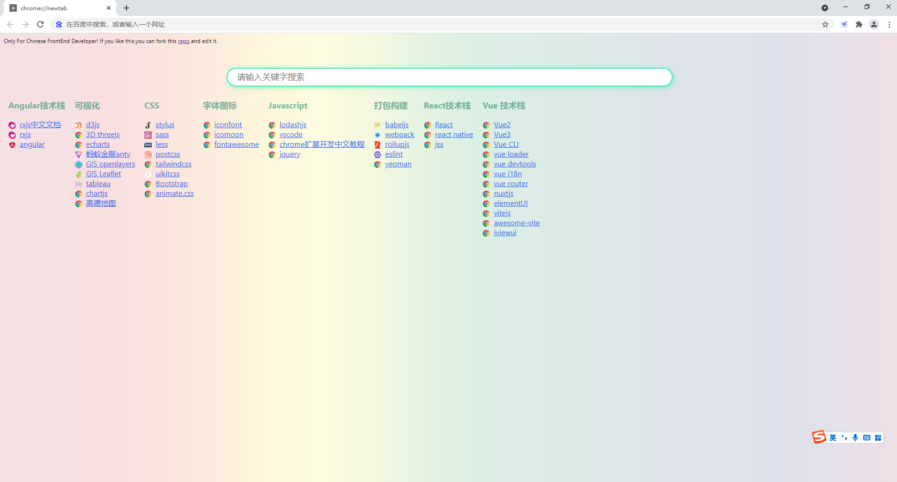

# Vue 3 Chrome extension boilerplate

**_Direcoty structure_**

```
├── assets/                           # 这里放 *.yml 文件
├── background/                       # background scripts
│   └── background.js
├── content/                          # content scripts
│   └── content.js
├── index.html
├── lib/
│   └── util.js
├── manifest.json
└── option/                           # option page/scripts
    ├── components/
    │   └── App.vue
    └── option.js
```
# web.devdocs.chrome.welcome
Chrome 新标签页插件，前端开发专用



